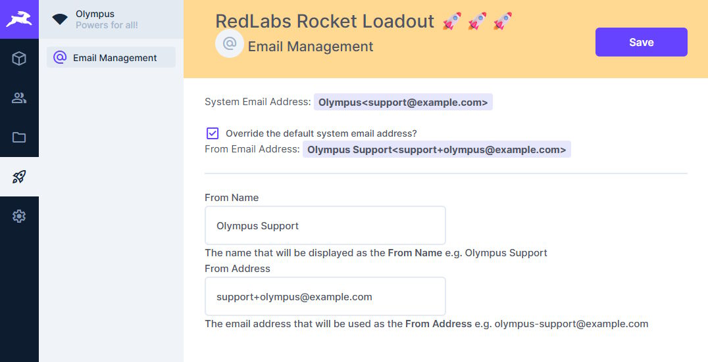

# RedLabs Rocket Loadout 🚀

Enhanced loadout (settings and features) for your Directus instance  

#### Quick Notes
1. Provided '_as is_'. See πRATE_LICENSE_☠️.md_
2. Enhancements? Maybe. Bug fixes? Maybe. Responding to issues? Maybe...
3. Happy huntin'


## Features

### 📧 Email Management Module
- **Admin-only access** to email configuration settings
- **Override system email address** with custom name and address
- **Visual interface** to manage email settings directly from Directus admin panel
- **Real-time preview** of current system email & overridden email

### 🔗 Email Hook
- **Automatic email override** when sending emails through Directus
- **Custom FROM address** configuration stored in database
- **Seamless integration** with existing Directus email functionality

### 🌐 Environment Endpoint
- **API endpoint** (`/red/env`) to access limited non-sensitive variables

### 🆘 Help....
- **Module Access to Environment Variables** 
- tbh we only have the environment endpoint as we could not figure out how to access env variables from the module  
- ... to get the __EMAIL_FROM__ environment variable
- Using an API endpoint to get this is convulted and counter-intuitive.
- Happy to get advice how we could do this differently

---



## Installation

### Prerequisites
- Directus v11.10.1 or higher  
    -- As the ability to override email_from address was added at this point
- Admin access to Directus instance

### Install Extension
- Search for "Red Labs" or "Email" - it should pop up
- Install, configure and you are good to go

## Usage

### Email Management
1. Log in to Directus as an admin user
2. Got to Directus Settings > Settings
3. Enable the __RedLabs Rocket Loadout__ module so it appears in the module sidebar
2. Navigate to the **RedLabs Rocket Loadout 🚀🚀🚀** module in the sidebar
3. Access the **Email Management** section
4. Configure your custom email settings:
   - Enable/disable email override
   - Set custom sender name
   - Set custom sender email address
5. Save your settings

### API Endpoints

#### Get Environment Variables
```
GET /red/env
```

Returns limited, safe environment variables:
```json
{
  "EMAIL_FROM": "noreply@example.com",
  "PUBLIC_URL": "https://your-directus-instance.com"
}
```

## Configuration

### Database Setup
The extension automatically creates a `red_loadout` collection to store configuration settings
- `email_override` (boolean) - Enable/disable custom email settings
- `email_name` (string) - Custom sender name
- `email_address` (string) - Custom sender email address

## Development

See: [Directus Extensions Overview](https://directus.io/docs/guides/extensions/overview)

### Install via npm
```bash
npm install @red-labs/rocket-loadout
```

### Manual Installation
1. Download the extension package
2. Extract to your Directus extensions directory
```bash
# Install & Build
npm install
npm run build
```
3. Restart your Directus instance

---

### From: RedLabs 🚀🚀🚀  
**More features??** Massive time constraints, but who knows! 😎  
<br/>

Arrr, May the Kraken ever look upon ye with favor! 🐙  
